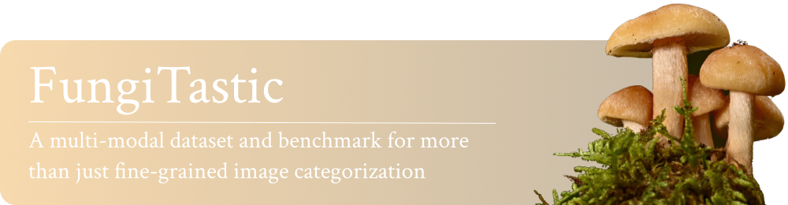

<div align="center">
<hr>
<a href="https://huggingface.co/collections/BVRA/fungitastic-66a227ce0520be533dc6403b"></a>
<a href="https://arxiv.org/pdf/2408.13632"></a>
<br><br>
</div>

> ⚠️ All active development and documentation is available in **dev**. Feel free to open issues or pull requests against **dev**!

> 🚧 **Work in Progress**  
> Most of our guides, examples, baselines and the full dataset download instructions live in the **dev** branch.  
> Please head over there for the latest code, tutorials, and model checkpoints!

# FungiTastic

FungiTastic is a large-scale, multimodal benchmark and dataset of fungal observations spanning 20 years, expert-verified (including DNA-sequenced ground truth) and enriched with environmental, geospatial, and segmentation metadata. It supports a wide range of tasks:

- **Closed-set & Open-set Classification**  
- **Few-shot & Chronological Classification**  
- **Cost-sensitive Classification**  
- **Semantic & Instance Segmentation**

### Quick Links

- 🌱 **Development branch**: [Dev Branch](https://github.com/BohemianVRA/FungiTastic/tree/dev)  
- 📥 **Dataset download guide**: [Dev/dataset/README.md](https://github.com/BohemianVRA/FungiTastic/tree/dev/dataset)  
- 🤗 **Pretrained models**: [HuggingFace collection](https://huggingface.co/collections/BVRA/fungitastic-66a227ce0520be533dc6403b)  
- 📊 **Paper & benchmarks**: [arXiv 2408.13632](https://arxiv.org/pdf/2408.13632)  

## Getting Started

If you’re new, jump into the **dev** branch:

```bash
git https://github.com/BohemianVRA/FungiTastic/
cd FungiTastic
git checkout dev
```
