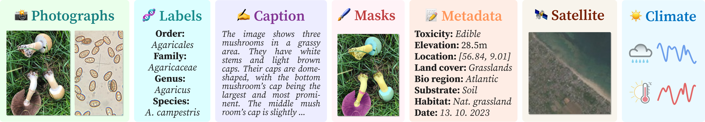

  

FungiTastic is a new, challenging benchmark and a dataset, based on fungal records
continuously collected over a twenty-year span. The dataset is labeled and curated by experts and consists of about 350k multimodal observations 
of 5k fine-grained categories (species). The fungi observations include photographs and additional data, e.g., meteorological and climatic data, satellite images, and body part segmentation masks.
FungiTastic is one of the few benchmarks that include a test set with DNA-sequenced ground truth of unprecedented label reliability.
The benchmark is designed to support:
- (i) standard closed-set classification, 
- (ii) open-set classification,
- (iii) multi-modal classification,
- (iv) few-shot learning, 
- (v) domain shift, and many more.

Detailed instructions on how to download the dataset are in the [dataset download guide](dataset/README.md).

For most use cases, we provide tailored baselines, a multitude of ready-to-use pre-trained models on 
[HuggingFace](https://huggingface.co/collections/BVRA/fungitastic-66a227ce0520be533dc6403b),
and a framework for model training. The documentation and the baselines are/_will be_ available at in this repo
and in the [Kaggle dataset](https://www.kaggle.com/datasets/picekl/fungitastic).

## FungiTastic Benchmarks

The diversity and unique features of the FungiTastic dataset allow for the evaluation of various fundamental computer vision and machine learning problems.  
We present several distinct benchmarks, each with its own evaluation protocol which is further described in our dataset paper. 

### 🔒📊 Closed-set classification
The FungiTastic dataset is a challenging dataset with many visually similar species, heavy long-tailed distribution, and considerable distribution shifts over time.
### 🌍🔓 Open-set classification
In the Atlas of Danish Fungi (our data source), new species are continuously added to the database, including previously unreported species. This ongoing data acquisition enables a yearly data split with a natural class distribution shift, and many species in the test data are absent in the training set.

### 🎯🔍 Few-shot classification
All the categories with less than five samples in the FungiTastic, usually uncommon and rare species, form the few-shot subset. Being capable of recognizing those, is of high interest to the experts.
### ⏳🍄 Chronological classification
Each observation in the fungi dataset has a timestamp, allowing the study of species distribution changes over time. Fungi distribution is seasonal and influenced by weather, such as recent precipitation. New locations may be added over time, providing a real-world benchmark for domain adaptation methods, including online, continual, and test-time adaptation. The test dataset consists of fungi images ordered chronologically, meaning a model processing an observation at time _t_ can access all observations with timestamps _t'_ < _t_.  

### ⚖️🚫🍄 Classification beyond 0–1 loss function
Evaluation of classification networks is typically based on the 0-1 loss function, such as the mean accuracy, which also applies to the metrics defined for the previous challenges. This often falls short of the desired metric in practice since not all errors are equal.  
In this challenge, we define two practical scenarios: In the first scenario, confusing a poisonous species for an edible one (false positive edible mushroom) incurs a much higher cost than that of a false positive poisonous mushroom prediction. In the second scenario, the cost of not recognizing that an image belongs to a new species should be higher.  

### 🖼️✂️ Segmentation
Acquiring human-annotated segmentation masks can be resource-intensive, yet segmentation is vital for advanced recognition and fine-grained classification methods. Accurate segmentation of fungal images supports these methods and enables automated analysis of species-specific morphological and environmental relationships, revealing ecological and morphological patterns across locations. With its annotations, FungiTastic-M is built to accommodate semantic segmentation and instance segmentation.

## 🗃️ Available Data and Metadata

<figure>
  
  <figcaption>Figure 1: <b>A FungiTastic observation</b> includes 
        one or more photos of an observed specimen with expert-verified taxon labels (some DNA sequenced) and occasionally also a microscopic image of its spores. 
        For a subset (~70k photos), we provide body part segmentation masks.
        Textual captions, observation metadata, geospatial data, and climatic time-series data are available for virtually
        all observations. </figcaption>
</figure>

For the majority of the fungi observations, we curated a wide range of accompanying data / metadata, including but not limited to:
- <b>Photographs:</b> Each fungi observation consists of one or more images, some observations also include a microscopic image of spores.
- <b>Taxonomic labels:</b> Each observation _label_ was verified by an expert and includes a full taxonomy (i.e., biological hierarchy). A small subset of around 2k were DNA sequenced.
- <b>Body part segmentation masks:</b> For the FungiTastic-M, we provide a human-made (with a help of SAM) annotations, delineate specific morphological features of fungi fruiting bodies, such as caps, gills, pores, rings, and stems,
- <b>Tabular metadata</b>, includes key environmental attributes and taxonomic information for nearly all observations,
- <b>Remote sensing data</b> at fine-resolution geospatial scale for are provided for all European observation sites,
- <b>Meteorological data</b> 20 years of meteorological data for each observation site, 
- <b>Image captions</b>, each image got a MOLMO-8B 

**All that metadata is integral to advancing research combining visual, textual, environmental, and taxonomic information.**